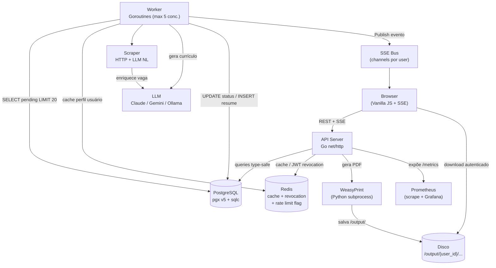
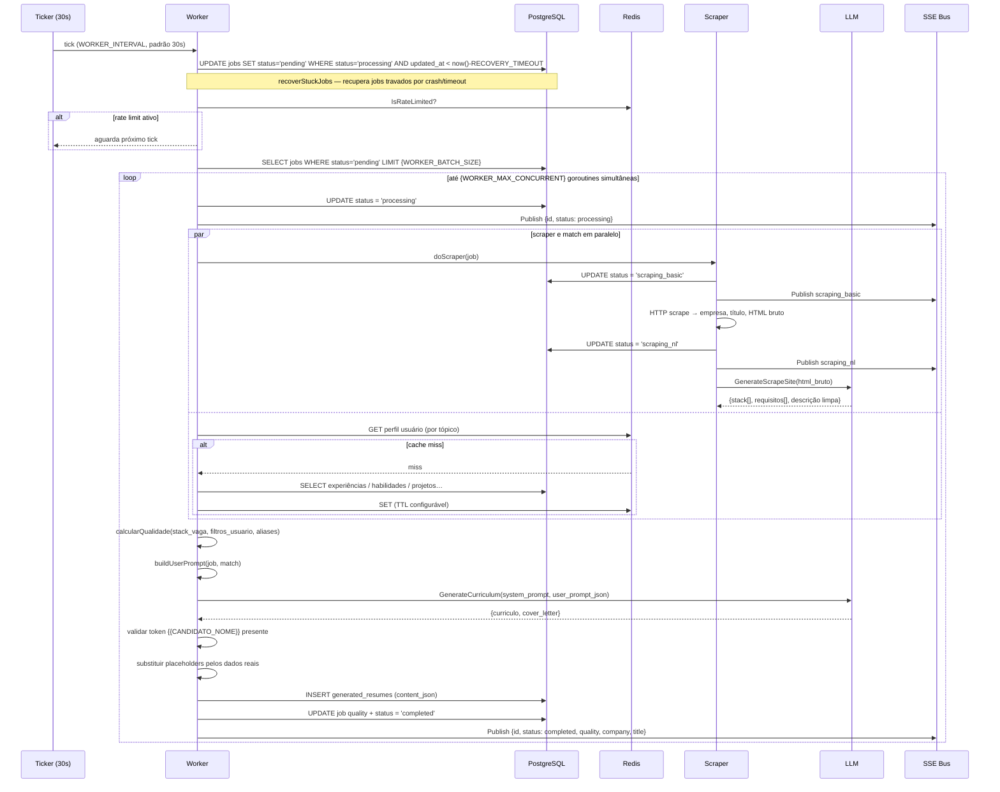
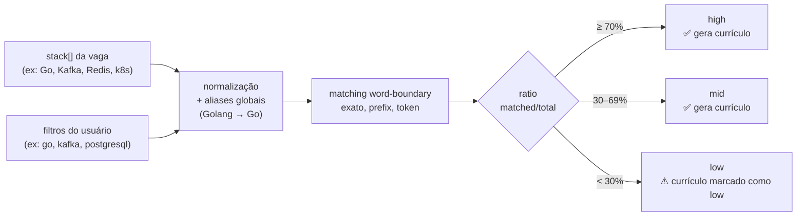
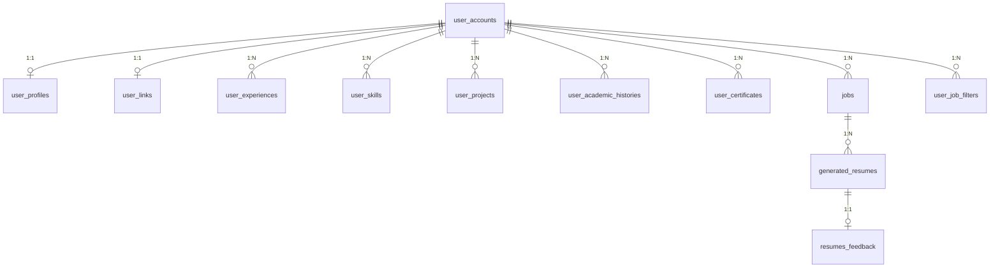
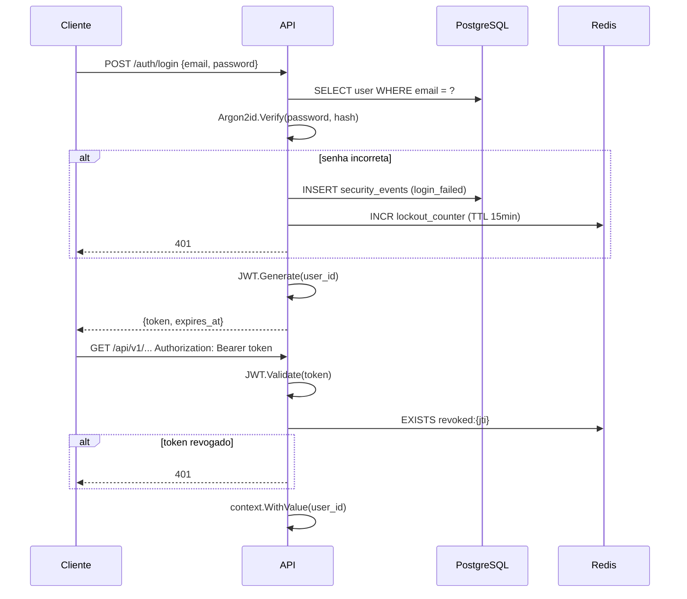
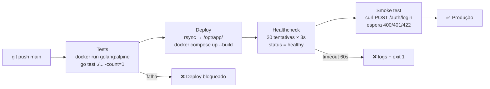

# Job Pipeline

[](https://github.com/ZeroPirata/jubilant-fishstick/actions/workflows/deploy.yml)


Plataforma end-to-end para geração automatizada de currículos e cartas de apresentação personalizados por IA. O sistema automatiza todo o ciclo de candidatura: coleta dados da vaga, analisa compatibilidade com o perfil do candidato, gera documentos via LLM e entrega PDFs prontos para envio — sem intervenção manual.

---

## Visão Geral

```
Usuário cadastra uma vaga (URL ou dados manuais)
              │
              ▼
     Job salvo → status: pending
              │
              ▼ (Worker a cada 30s, até 5 jobs simultâneos)
  ┌────────────────────────────────────────────┐
  │  recovery check  → jobs em 'processing'    │  travados há > RECOVERY_TIMEOUT → pending
  │  scraping_basic  → HTTP scraper            │  empresa, título, descrição bruta
  │  scraping_nl     → LLM estrutura a vaga    │  stack[], requisitos[], descrição limpa
  │  match perfil    → Redis cache + Postgres  │  experiências, habilidades, projetos…
  │  quality score   → algoritmo de matching   │  low / mid / high
  │  buildUserPrompt → JSON para o LLM         │  dados truncados e ordenados
  │  LLM gera docs   → currículo + cover       │  tokens de sistema preservados
  │  substituição    → dados reais do usuário  │  {{CANDIDATO_NOME}} → "Gabriel"
  └────────────────────────────────────────────┘
              │
              ▼
     Currículo salvo no banco → status: completed
              │
              ▼  (sob demanda do usuário)
     WeasyPrint renderiza HTML/CSS → PDF entregue via download autenticado
```

Atualizações de status chegam em tempo real no browser via **Server-Sent Events (SSE)** — sem polling.

---

## Arquitetura



---

## Stack

| Camada | Tecnologia |
|---|---|
| Backend | Go 1.24+ — `net/http` puro, sem framework |
| Banco de dados | PostgreSQL com `pgx v5` |
| Query builder | sqlc — queries SQL compiladas para Go type-safe |
| Cache | Redis — cache de perfil, flag de rate limit, revogação de JWT |
| LLM | Claude (Anthropic) · Gemini · Ollama — configurável por variável |
| PDF | WeasyPrint (Python) — processo persistente chamado via subprocess |
| Auth | JWT HS256 + Argon2id + Redis revocation list |
| Real-time | Server-Sent Events (SSE) — bus in-memory por `user_id` |
| Logging | Uber Zap |
| Observabilidade | Prometheus client (metrics) — endpoint `/metrics` compatível com Grafana |
| Testes | `go test` — handler, middleware, worker, security, services, util |
| CI/CD | GitHub Actions (self-hosted) — test gate → deploy → healthcheck → smoke test |
| Infra | Docker + Docker Compose |

---

## Pipeline em Detalhe

### 1. Cadastro da vaga

O usuário envia uma URL (ex: LinkedIn, Amazon Jobs, Jobright) ou preenche os dados manualmente. O backend valida a URL contra uma lista de domínios públicos permitidos e insere o job no banco com `status = pending`.

Se a URL já foi cadastrada pelo mesmo usuário, o banco retorna `UNIQUE constraint` e a API responde `409 Conflict`.

### 2. Worker — ciclo configurável



### 3. Scraping em dois estágios

**scraping_basic** — scraper HTTP por plataforma:

| Plataforma | Extrai |
|---|---|
| LinkedIn | `?currentJobId=` ou `/jobs/view/{id}` — título, empresa, corpo da vaga |
| Amazon Jobs | HTML estruturado |
| GeekHunter | HTML + metadados |
| Jobright | API JSON pública |

**scraping_nl** — LLM lê o HTML bruto e extrai:
- `stack[]` — tecnologias e ferramentas mencionadas
- `requisitos[]` — competências e pré-requisitos
- `descrição` — versão limpa e comprimida

Os dois estágios são separados para permitir que plataformas sem scraper nativo ainda funcionem: o usuário cola a descrição manualmente e o `scraping_nl` estrutura o conteúdo.

### 4. Match com o perfil

O worker busca **todos** os dados do usuário sem filtrar por tags no banco, pois a LLM faz seleção de relevância melhor do que heurísticas locais. Para evitar consultas repetidas durante o processamento em lote, cada entidade é cacheada no Redis por tópico:

```
cache key: {user_id}:{topic}
tópicos: experiences · skills · projects · academic · certificates
```

O cache é invalidado quando o usuário altera o perfil (upsert/delete em qualquer entidade).

Junto com os dados do perfil, o worker busca:
- **Exemplos excelentes** — currículos com feedback `excellent` injetados no prompt como referência de qualidade
- **Feedbacks anteriores** — comentários de avaliações `poor/fair` injetados como proibições

### 5. Score de qualidade



O matching é **word-boundary aware**: o filtro `go` não bate em `gorilla` ou `django`. As regras de verificação em ordem:
1. Match exato: `"go" == "go"`
2. Prefix com separador: `"go"` bate em `"go.uber.org"` (próximo char é `.`)
3. Token exato: split por ` `, `.`, `-`, `/`, `_` e compara cada token

A tabela `stack_aliases` no banco normaliza variações globalmente: `Golang → Go`, `Postgres → PostgreSQL`, etc.

### 6. Construção do prompt

`buildUserPrompt` monta um JSON com os dados de entrada para o LLM, aplicando limites de truncamento:

| Campo | Limite |
|---|---|
| Experiências | máx. 5 (mais recentes) |
| Conquistas por experiência | máx. 4 |
| Projetos | máx. 6 |
| Exemplos excelentes | máx. 1 |

Seções com arrays vazios são **omitidas do JSON** via `omitempty` — o LLM não recebe o campo e, portanto, não gera a seção no currículo. Isso garante que usuários sem projetos, formação ou certificados não recebam seções vazias no documento final.

### 7. Geração via LLM

O system prompt (PT-BR e EN) instrui o modelo a:
- Retornar **somente JSON válido** `{ "curriculo": "...", "cover_letter": "..." }`
- Preservar literalmente os tokens `{{CANDIDATO_NOME}}`, `{{CANDIDATO_EMAIL}}`, etc.
- Nunca inventar dados não presentes no input (regra de anti-alucinação)
- Seguir regras rígidas de bullet points (O QUÊ + COMO + IMPACTO)
- Usar feedbacks anteriores como proibições

Após receber a resposta, o worker valida que `{{CANDIDATO_NOME}}` está presente no texto gerado. Se o LLM substituiu os tokens por texto descritivo, a resposta é **rejeitada** e o job vai para `error`.

### 8. Substituição de placeholders

```go
strings.NewReplacer(
    "{{CANDIDATO_NOME}}",      profile.FullName,
    "{{CANDIDATO_EMAIL}}",     profile.ContactEmail || profile.Email,
    "{{CANDIDATO_LINKEDIN}}",  profile.LinkedinUrl,
    "{{CANDIDATO_GITHUB}}",    profile.GithubUrl,
    "{{CANDIDATO_PORTFOLIO}}", portfolioStr,  // portfolio + other_links concatenados
    "{{CANDIDATO_TELEFONE}}",  profile.Phone,
    "{{VAGA_EMPRESA}}",        job.CompanyName,
    "{{VAGA_TITULO}}",         job.JobTitle,
)
```

Placeholders não preenchidos pelo usuário (ex: GitHub em branco) são removidos junto com separadores adjacentes via regex — o PDF nunca exibe `| | |` no cabeçalho.

### 9. Geração de PDF

O PDF não é gerado automaticamente — o usuário solicita explicitamente para cada currículo. Isso evita custo de processamento em currículos que o usuário não pretende usar.

O servidor Python (`gerar_pdf.py`) roda como **processo persistente** e recebe chamadas via `subprocess`. Isso elimina o overhead de inicialização do interpretador a cada geração. O WeasyPrint renderiza HTML/CSS e gera dois arquivos:

```
/output/{user_id}/{company}/{resume_id}/resume.pdf
/output/{user_id}/{company}/{resume_id}/cover_letter.pdf
```

O download é protegido: o middleware verifica que o `user_id` no path é o mesmo do JWT antes de servir o arquivo.

### 10. Rate limit do LLM

Quando a LLM retorna HTTP 429, o worker:
1. Seta uma flag no Redis com TTL de 12 horas
2. Reverte o job para `pending`
3. No próximo tick, verifica a flag antes de processar qualquer job

Isso protege a fila de jobs de tentativas em loop e respeita a janela de rate limit da API.

### 11. Recovery de jobs travados

Se o processo cair no meio de um processamento (`status = processing`), o job fica bloqueado e nunca avança. Em cada tick, o worker executa:

```sql
UPDATE jobs SET status = 'pending', updated_at = now()
WHERE status = 'processing'
  AND deleted_at IS NULL
  AND updated_at < now() - @cutoff
```

O `@cutoff` é `WORKER_RECOVERY_TIMEOUT` (padrão `10m`). Jobs travados há mais do que esse tempo voltam automaticamente para a fila. O contador `hackton_jobs_processed_total{status="recovered"}` do Prometheus registra cada recuperação.

A recovery roda **antes** do `processarPendentes` — assim os jobs recuperados são elegíveis já no mesmo tick.

### 12. Observabilidade — Prometheus

O servidor expõe `GET /metrics` no formato de texto Prometheus. As métricas disponíveis:

| Métrica | Tipo | Labels | O que mede |
|---|---|---|---|
| `hackton_jobs_processed_total` | Counter | `status` (`completed`, `error`, `recovered`) | Total de jobs finalizados por resultado |
| `hackton_llm_duration_seconds` | Histogram | `status` (`ok`, `error`, `rate_limit`) | Latência das chamadas ao LLM principal (buckets: 1s–5m) |
| `hackton_scraper_duration_seconds` | Histogram | `status` (`ok`, `error`) | Duração total do scraper por job — HTTP + NL (buckets: 500ms–1m) |
| `hackton_worker_active_goroutines` | Gauge | — | Goroutines processando jobs no momento |

Além das métricas da aplicação, o endpoint publica automaticamente as métricas padrão do Go runtime (GC, heap, goroutines do processo, etc.) via `promauto`.

Para conectar o Grafana, configure um datasource Prometheus apontando para `http://<host>:8080/metrics`.

---

## SSE — Real-time

O browser abre uma conexão `GET /api/v1/jobs/events` logo após o login. O servidor mantém um channel Go por `user_id` em um bus in-memory. Quando o worker publica um evento, o handler SSE do usuário o serializa e envia.

```
Eventos publicados pelo worker:
  { id, status: "processing" }
  { id, status: "scraping_basic" }
  { id, status: "scraping_nl" }
  { id, status: "completed", quality, company_name, job_title }
  { id, status: "error" }
```

O endpoint SSE fica fora do `TimeoutMiddleware` — é uma conexão longa por design. Um keepalive de `: keepalive\n\n` é enviado a cada 20 segundos para evitar que proxies fechem a conexão por inatividade.

---

## Banco de Dados

### Modelo de entidades



### Tabelas principais

| Tabela | Descrição |
|---|---|
| `user_accounts` | Conta com email único e hash Argon2id |
| `user_profiles` | Dados pessoais: nome, telefone, about, email de contato |
| `user_links` | LinkedIn, GitHub, portfólio, outros links (JSONB) |
| `user_experiences` | Experiências com `tech_stack[]`, `achievements[]`, `tags[]` |
| `user_skills` | Habilidades com nível (`basic/intermediate/advanced/expert`) |
| `user_projects` | Projetos com `tags[]` e flag `is_academic` |
| `user_academic_histories` | Formação com período e descrição |
| `user_certificates` | Certificados com emissor, data e URL de verificação |
| `jobs` | Vagas com status enum, quality enum, stack[], requirements[] |
| `generated_resumes` | Currículos gerados em JSONB + caminhos dos PDFs |
| `resumes_feedback` | Avaliação única por currículo (`poor/fair/good/excellent`) |
| `user_job_filters` | Keywords de filtro de compatibilidade por usuário |
| `stack_aliases` | Mapa global de normalização de tecnologias (`Golang → Go`) |
| `security_events` | Log de eventos de segurança (login falho, rate limit, PDF gerado) |

### Índices relevantes

```sql
-- Busca de jobs pendentes: lê só o que importa para o worker
CREATE INDEX idx_jobs_pending_status ON jobs(status)
WHERE status = 'pending' AND deleted_at IS NULL;

-- Login: busca por email só em contas ativas
CREATE UNIQUE INDEX idx_active_users_email ON user_accounts(email)
WHERE deleted_at IS NULL;

-- Busca em arrays de tecnologias e tags (GIN)
CREATE INDEX idx_user_experiences_stack_gin ON user_experiences USING GIN(tech_stack);
CREATE INDEX idx_user_skills_tags_gin       ON user_skills      USING GIN(tags);
CREATE INDEX idx_jobs_tech_stack_gin        ON jobs             USING GIN(tech_stack);
```

### Queries e sqlc

As queries SQL ficam em `repository/query/*.sql`. O sqlc lê esses arquivos e gera código Go type-safe em `internal/db/`. O Go nunca monta queries por concatenação de string — toda interação com o banco passa por structs gerados.

Exemplo — busca de vagas com filtros opcionais por enum sem concatenação:

```sql
-- name: QuerySelectJobsForUser :many
SELECT j.*, COUNT(*) OVER() AS total_count
FROM jobs j
WHERE
    j.user_id = @user_id AND
    j.deleted_at IS NULL AND
    (@status::TEXT IS NULL OR j.status = @status::job_status) AND
    (@quality::TEXT IS NULL OR j.quality = @quality::job_quality)
ORDER BY j.created_at DESC
LIMIT @size OFFSET @cursor;
```

O `COUNT(*) OVER()` retorna o total de registros sem uma segunda query — a paginação é resolvida em uma única roundtrip ao banco.

---

## Auth e Segurança

### Fluxo de autenticação



### Camadas de segurança

| Mecanismo | Implementação |
|---|---|
| Senha | Argon2id com pepper + salt aleatório |
| Token | JWT HS256 com expiração configurável |
| Logout | JTI adicionado ao Redis — revocation list |
| Lockout | Contador no Redis por IP, bloqueio após N tentativas |
| Rate limit LLM | Flag no Redis com TTL de 12h após HTTP 429 |
| Download de PDF | Middleware verifica `owner_id == user_id` do JWT |
| Log de segurança | Tabela `security_events` com IP, user_id, metadata |
| CORS | Middleware configurável por ambiente |

---

## Middleware Stack

```
Request
  │
  ├─ CORS
  ├─ Panic Recovery
  ├─ Logger (Zap)
  ├─ Timeout (configurável por rota)
  ├─ Rate Limit (lockout por IP)
  ├─ Auth (JWT validate)
  ├─ Revocation (Redis check)
  └─ Handler
```

O endpoint SSE (`GET /api/v1/jobs/events`) é registrado com match exato fora do `TimeoutMiddleware`, pois é uma conexão de longa duração que não pode ser encerrada por timeout.

---

## CI/CD



O pipeline roda em **self-hosted runner** — o servidor de produção é o próprio executor. O deploy usa `rsync --delete` para sincronizar os arquivos e exclui `.env` e `data/` para não sobrescrever dados e segredos do servidor. O `docker compose up --build --remove-orphans` recria apenas os containers que tiveram mudança na imagem.

---

## Testes

```
internal/
├── handler/
│   ├── logout_test.go        — revogação de token no logout
│   ├── response_test.go      — helpers de serialização JSON
│   └── validation_test.go    — validação de campos obrigatórios
├── middleware/
│   ├── cors_test.go          — headers CORS por método e origem
│   ├── middleware_test.go    — AuthMiddleware com stub de TokenProvider
│   └── revocation_test.go   — checagem de JTI revogado no Redis
├── worker/
│   ├── build_prompt_test.go  — truncamentos, datas, tokens de sistema, JSON válido
│   └── calculate_quality_test.go — ratios, word-boundary matching, aliases
├── security/
│   └── security_test.go      — hash Argon2id, JWT generate/validate
├── services/
│   └── service_test.go, util_test.go
└── util/
    └── url_test.go, util_test.go
```

Rodar todos os testes:

```bash
go test ./... -count=1 -timeout 60s
```

---

## API

Todos os endpoints protegidos exigem:
```
Authorization: Bearer <jwt>
```

### Auth

| Método | Endpoint | Descrição |
|---|---|---|
| POST | `/api/v1/auth/register` | Cria conta |
| POST | `/api/v1/auth/login` | Autentica, retorna JWT |
| POST | `/api/v1/auth/logout` | Revoga o token atual |

### Perfil

| Método | Endpoint | Descrição |
|---|---|---|
| GET / PUT | `/api/v1/users/me/profile` | Dados pessoais |
| PUT | `/api/v1/users/me/links` | Links (LinkedIn, GitHub, portfólio, outros) |
| GET / POST | `/api/v1/users/me/experiences` | Experiências profissionais |
| PUT / DELETE | `/api/v1/users/me/experiences/{id}` | Editar / remover |
| GET / POST | `/api/v1/users/me/skills` | Habilidades |
| PUT / DELETE | `/api/v1/users/me/skills/{id}` | Editar / remover |
| GET / POST | `/api/v1/users/me/projects` | Projetos |
| PUT / DELETE | `/api/v1/users/me/projects/{id}` | Editar / remover |
| GET / POST | `/api/v1/users/me/academic` | Formação acadêmica |
| PUT / DELETE | `/api/v1/users/me/academic/{id}` | Editar / remover |
| GET / POST | `/api/v1/users/me/certificates` | Certificados |
| PUT / DELETE | `/api/v1/users/me/certificates/{id}` | Editar / remover |

Todos os endpoints de listagem suportam paginação por cursor (`?offset=0&size=20`) e busca textual (`?search=golang`).

### Vagas e currículos

| Método | Endpoint | Descrição |
|---|---|---|
| GET | `/api/v1/jobs` | Listar vagas (`?status=completed&quality=high`) |
| POST | `/api/v1/jobs` | Cadastrar vaga |
| PUT / DELETE | `/api/v1/jobs/{id}` | Atualizar / remover vaga |
| PUT | `/api/v1/jobs/{id}/retry` | Reprocessar vaga com erro |
| GET | `/api/v1/jobs/{id}/resumes` | Listar currículos da vaga |
| GET | `/api/v1/jobs/{id}/resumes/{resume_id}` | Ver currículo |
| DELETE | `/api/v1/jobs/{id}/resumes/{resume_id}` | Remover currículo |
| POST | `/api/v1/jobs/{id}/resumes/{resume_id}/pdf` | Gerar PDF |
| POST | `/api/v1/jobs/{id}/resumes/{resume_id}/feedback` | Avaliar currículo |
| GET | `/api/v1/jobs/events` | SSE stream de eventos em tempo real |

### Filtros de qualidade

| Método | Endpoint | Descrição |
|---|---|---|
| GET / POST | `/api/v1/filters` | Listar / adicionar keyword de compatibilidade |
| DELETE | `/api/v1/filters/{id}` | Remover filtro |

Filtros são keywords técnicas (`golang`, `grpc`, `kubernetes`) que o worker usa para calcular o score de compatibilidade de cada vaga com o perfil do usuário.

### Observabilidade

| Método | Endpoint | Descrição |
|---|---|---|
| GET | `/metrics` | Métricas Prometheus (jobs, LLM latency, scraper, goroutines) |

O endpoint não requer autenticação — destinado a ser exposto apenas na rede interna ou via scrape do Prometheus.

---

## Pré-requisitos

- Docker + Docker Compose
- VS Code com a extensão Dev Containers (para desenvolvimento local)

---

## Rodando localmente

O ambiente de desenvolvimento roda inteiramente dentro de um Dev Container.

```bash
# Abra o projeto no VS Code e aceite "Reopen in Container"
# ou via linha de comando:
devcontainer open .
```

O container sobe automaticamente com Go, PostgreSQL, Redis e todas as dependências instaladas via `.devcontainer/install-tools.sh`.

### Variáveis de ambiente

Crie um arquivo `.env` na raiz com base no `.env.example`:

```env
# Servidor
SERVER_HOST=0.0.0.0
SERVER_PORT=8080
CONTEXT_TIMEOUT=60s

# PostgreSQL
POSTGRES_HOST=db
POSTGRES_PORT=5432
POSTGRES_USER=postgres
POSTGRES_PASSWORD=postgres
POSTGRES_DB=hackton
POSTGRES_SSL_MODE=disable
POSTGRES_MAX_CONNECTIONS=10

# Redis
REDIS_ADDR=cache:6379
REDIS_PASSWORD=

# LLM principal (geração de currículo)
API_PROVIDER=claude          # claude | gemini | ollama
API_KEY_AI=sk-ant-...
API_URL_AI=https://api.anthropic.com/v1/messages
API_MODEL_AI=claude-sonnet-4-5

# LLM de scraping (opcional)
SCRAPE_AI_ACTIVATE=false
SCRAPE_AI_PROVIDER=claude
SCRAPE_AI_KEY=sk-ant-...
SCRAPE_AI_MODEL=claude-haiku-4-5-20251001

# Worker
WORKER_MAX_CONCURRENT=5    # goroutines simultâneas (gargalo real: rate limit da LLM)
WORKER_BATCH_SIZE=20       # jobs buscados por tick
WORKER_INTERVAL=30s        # intervalo entre verificações
WORKER_RECOVERY_TIMEOUT=10m  # jobs em 'processing' por mais de X voltam para 'pending'

# Autenticação
JWT_SECRET=troque-isso
JWT_EXPIRATION=24h

# Hashing (Argon2id)
HASH_ARGON2_PEPPER=troque-isso
HASH_ARGON2_MEMORY=65536
HASH_ARGON2_ITERATIONS=3
HASH_ARGON2_PARALLELISM=2
HASH_ARGON2_SALT_LEN=16
HASH_ARGON2_KEY_LEN=32

# Misc
DEBUG=false
PROJECT_NAME=hackton-treino
VERSION=0.1.0
```

### Banco de dados

```bash
# Aplicar schema
psql -U postgres -d hackton -f repository/schema.sql

# Popular com dados de seed (opcional)
psql -U postgres -d hackton -f .vscode/seed.sql
```

### Rodando a aplicação

```bash
# Com hot reload (air):
make air

# Sem hot reload:
go run ./cmd/server
```

---

## Build de produção

```bash
docker compose up -d --build
```

O Dockerfile usa multi-stage build: compila o binário Go em `golang:alpine` e copia apenas o binário + assets para uma imagem final `python:3.12-slim` com WeasyPrint instalado. O `entrypoint.sh` inicia o servidor Python de PDF e em seguida o binário Go.

---

## Estrutura do projeto

```
.
├── cmd/server/              # Entrypoint — inicializa DB, Redis, Worker, HTTP server
├── config/                  # Configuração via variáveis de ambiente
├── database/                # Pool pgxpool + cliente Redis
├── internal/
│   ├── db/                  # Código gerado pelo sqlc (type-safe, não editar)
│   ├── handler/             # Handlers HTTP + helpers genéricos (GenericList, GenericCreate…)
│   ├── lockout/             # Rate limit de login por IP via Redis
│   ├── metrics/             # Métricas Prometheus (promauto — registro automático)
│   ├── middleware/          # Auth, CORS, logger, timeout, panic recovery, revocation
│   ├── repository/          # Interfaces e implementações de acesso a dados
│   │   ├── cache/           # Abstração Redis (GetTyped/SetTyped + tópicos)
│   │   ├── jobs/            # Repositório de vagas e currículos
│   │   ├── users/           # Repositório de perfil do usuário
│   │   ├── feedbacks/       # Repositório de feedbacks e exemplos excelentes
│   │   ├── aliases/         # Repositório de aliases de tecnologias
│   │   ├── worker/          # Repositório exclusivo do worker (pipeline + recovery)
│   │   └── secevents/       # Log de eventos de segurança
│   ├── routes/              # Registro de rotas e middlewares
│   ├── scraper/             # Scrapers por plataforma (LinkedIn, Amazon, Jobright…)
│   ├── security/            # JWT (HS256) + Argon2id + revogação
│   ├── services/            # Integração com LLMs (Claude, Gemini, Ollama)
│   ├── sse/                 # Bus in-memory de Server-Sent Events
│   ├── util/                # Helpers (UUID parse, normalização de stack, IP, datas…)
│   └── worker/              # Pipeline assíncrono
│       └── prompts/         # System prompts (system_ptbr.txt, system_en.txt)
├── repository/
│   ├── schema.sql           # DDL completo (tabelas, tipos, índices)
│   └── query/               # Queries SQL (input do sqlc)
├── scripts/
│   └── gerar_pdf.py         # Servidor WeasyPrint (processo persistente)
├── static/                  # Frontend (HTML, CSS, JS vanilla)
├── .github/workflows/
│   └── deploy.yml           # CI/CD — test → deploy → healthcheck → smoke test
├── Dockerfile               # Multi-stage: Go build + Python/WeasyPrint runtime
├── docker-compose.yml       # app + db (PostgreSQL) + cache (Redis)
└── sqlc.yaml                # Configuração do gerador de código sqlc
```
